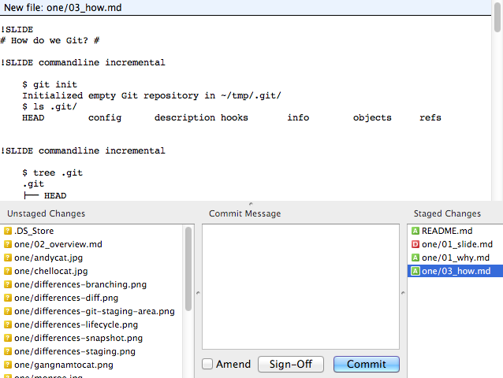

!SLIDE bullets incremental
# `diff svn git` #

* snapshots vs. differences

* 

!SLIDE bullets
# `diff svn git` #

* snapshots vs. differences

!SLIDE bullets incremental
# `diff svn git` #

* staging area

* 

!SLIDE bullets incremental
# `diff svn git` #

* staging area

* 

!SLIDE bullets
# `diff svn git` #

* staging area

!SLIDE bullets
# `diff svn git` #

* branch model

!SLIDE bullets incremental
# `diff svn git` #

* `git checkout != svn checkout`

* `git checkout == svn revert`

* `git clone == svn checkout`
