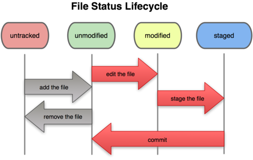

!SLIDE bullets incremental
# `diff svn git` #

* snapshots vs. differences

* 

!SLIDE bullets
# `diff svn git` #

* snapshots vs. differences

!SLIDE bullets incremental
# `diff svn git` #

* staging area

* 

!SLIDE bullets incremental
# `diff svn git` #

* staging area

* 

!SLIDE bullets
# `diff svn git` #

* staging area

!SLIDE bullets
# `diff svn git` #

* branch model

!SLIDE bullets incremental
# `diff svn git` #

* `git status == svn status`
* `git blame == svn blame`
* `git commit == svn commit`
* `git add == svn add`
* `git mv == svn mv`
* `git rm == svn rm`

!SLIDE bullets incremental
# `diff svn git` #

* `git log == svn log | less`
* `git diff == svn diff | less`

!SLIDE bullets incremental
# `diff svn git` #

* `git checkout != svn checkout`

* `git checkout == svn revert`

* `git clone == svn checkout`
